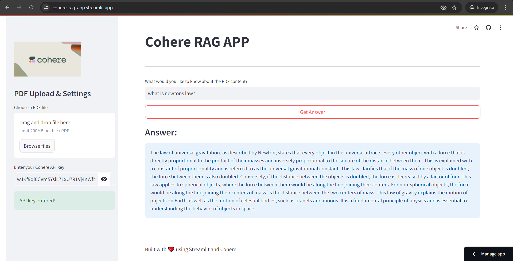

# Cohere RAG APP

## Conversational PDF Question Answering

This Streamlit application allows users to upload a PDF and ask questions about its content. The application uses Cohere's LLM, HuggingFace embeddings, and Chroma vectorstore to retrieve relevant information from the PDF and generate answers.

## Features

- Upload a PDF file.
- Enter your Cohere API key.
- Ask questions about the uploaded PDF.
- Get answers based on the PDF content.

## Requirements

- Python 3.8 or higher
- Streamlit
- PyPDF2
- LangChain libraries
- HuggingFace Embeddings
- Cohere API Key

## Installation

1. Clone the repository:

    ```bash
    git clone https://github.com/meakshayraut/cohere-rag.git
    cd cohere-rag
    ```

2. Create and activate a virtual environment:

    ```bash
    python -m venv venv
    source venv/bin/activate  # On Windows, use `venv\Scripts\activate`
    ```

3. Install the required packages:

    ```bash
    pip install -r requirements.txt
    ```

## Usage

1. Run the Streamlit application:

    ```bash
    streamlit run app.py
    ```

2. Open your browser and go to `http://localhost:8501`.

3. Enter your Cohere API key in the sidebar.

4. Upload a PDF file using the file uploader.

5. Ask questions about the PDF in the chat input.

## Project Structure

- `app.py`: Main application file.
- `requirements.txt`: List of required Python packages.

## Example

1. After running the application, you'll see the interface to enter your Cohere API key and upload a PDF file.
2. Once the PDF is uploaded, you can type a question in the chat input and receive an answer based on the PDF content.

## Screenshot



## Troubleshooting

- Ensure that you have a valid Cohere API key.
- Ensure that the PDF file is correctly uploaded and contains readable text.
- If the application fails to start, check for any missing dependencies and install them.
